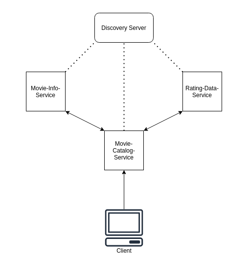

# Demo Application For Microservices. 
### v 0.1.0

 

 

### This sample system consists with 3 microservices and use the service discovery pattern
 

### Technologies used.
- Spring Boot - For creating microservices.
- Spring Cloud - Netflix Eureka for service discovery.